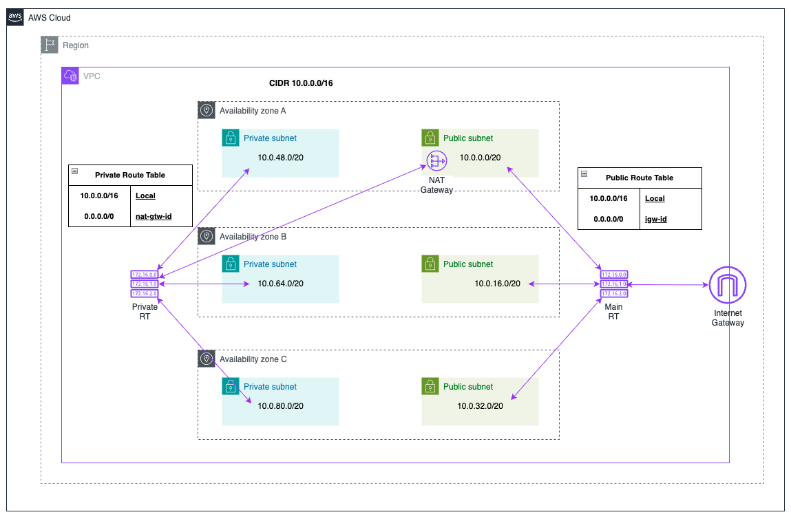

# VPC Module

This module is responsible for creating and managing an AWS Virtual Private Cloud (VPC) and its associated resources. It allows you to configure the VPC name, CIDR block, public and private subnets, and apply custom tags. The module outputs the VPC ID, subnet IDs, and route table IDs for further use.

Default VPC Design



## Features

- Creates a VPC with configurable CIDR block.
- Supports public and private subnets.
- Configures route tables and internet gateway.
- Provides outputs for VPC ID, subnets, and route tables.

## Usage

```hcl
module "vpc" {
    source = "./modules/aws/networking/vpc"

    vpc_name        = "my-vpc"
    vpc_cidr_block  = "10.0.0.0/16"
    public_subnets  = ["10.0.1.0/24", "10.0.2.0/24"]
    private_subnets = ["10.0.3.0/24", "10.0.4.0/24"]

    tags = {
        Environment = "dev"
        Project     = "poc-confluent-cloud"
    }
}
```

## Inputs

| Name                     | Description                                              | Type   | Default        | Required |
|--------------------------|----------------------------------------------------------|--------|----------------|----------|
| `vpc_name`               | Name to assign to the VPC                                | string | n/a            | yes      |
| `cidr_block`             | CIDR block defining the VPC's IP range                   | string | `10.0.0.0/16`  | no       |
| `public_az1_cidr_block`  | CIDR block for the public subnet in Availability Zone 1  | string | `10.0.0.0/20`  | no       |
| `public_az2_cidr_block`  | CIDR block for the public subnet in Availability Zone 2  | string | `10.0.16.0/20` | no       |
| `public_az3_cidr_block`  | CIDR block for the public subnet in Availability Zone 3  | string | `10.0.32.0/20` | no       |
| `private_az1_cidr_block` | CIDR block for the private subnet in Availability Zone 1 | string | `10.0.48.0/20` | no       |
| `private_az2_cidr_block` | CIDR block for the private subnet in Availability Zone 2 | string | `10.0.64.0/20` | no       |
| `private_az3_cidr_block` | CIDR block for the private subnet in Availability Zone 3 | string | `10.0.80.0/20` | no       |
| `eks_name`               | EKS Cluster Name                                         | string | n/a            | yes      |

## Outputs

| Name                     | Description                                            |
|--------------------------|--------------------------------------------------------|
| `vpc_id`                 | ID of the created VPC                                  |
| `public_route_table_id`  | ID of the public route table                           |
| `private_route_table_id` | ID of the private route table                          |
| `private_zones_map`      | Mapping of private subnets to their availability zones |
| `public_subnets`         | IDs of the created public subnets                      |
| `private_subnets`        | IDs of the created private subnets                     |
| `public_subnet_az1_id`   | ID of the public subnet in Availability Zone 1         |
| `public_subnet_az2_id`   | ID of the public subnet in Availability Zone 2         |
| `public_subnet_az3_id`   | ID of the public subnet in Availability Zone 3         |
| `private_subnet_az1_id`  | ID of the private subnet in Availability Zone 1        |
| `private_subnet_az2_id`  | ID of the private subnet in Availability Zone 2        |
| `private_subnet_az3_id`  | ID of the private subnet in Availability Zone 3        |

## Prerequisites

- Terraform installed.

## License

This module is licensed under the MIT License. See [LICENSE](../../../../LICENSE) for details.
